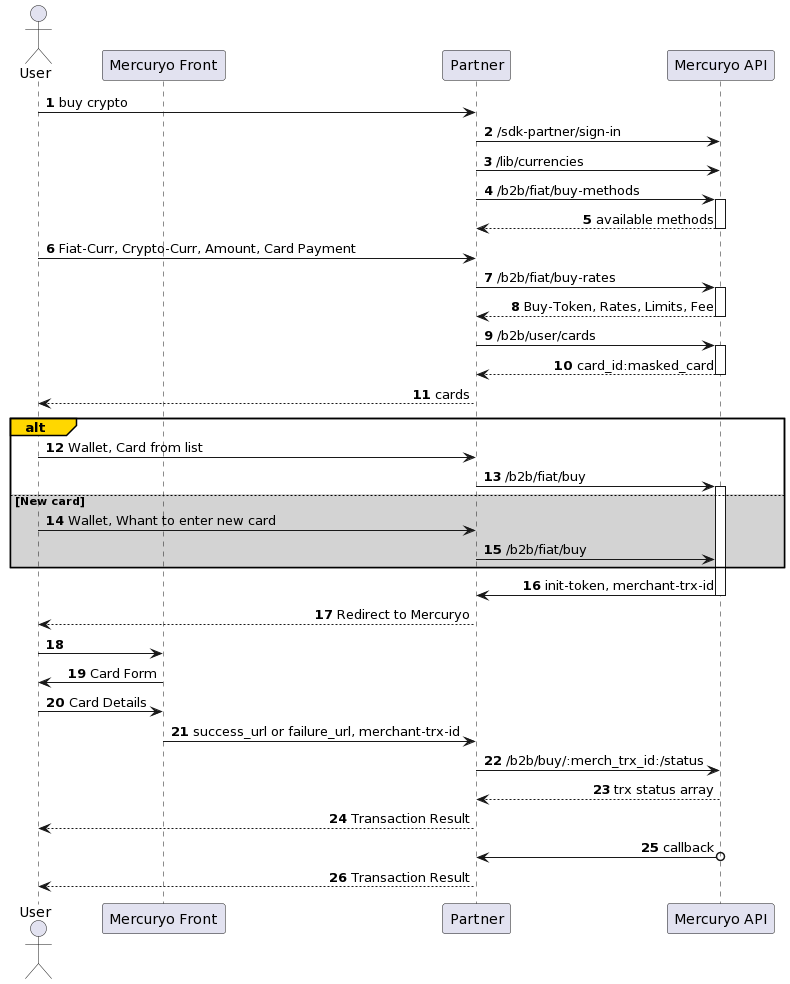

1. [Steps](#steps)
2. [Scheme](#scheme)

***

#### 1. Steps

1. The Customer wants to buy crypto.
2. You will need to authorize customer and check if he can use Mercuryo API. Please check [this](../new-sign-in/README.md) for more information.
3. Use method [`GET /lib/currencies`](https://sandbox-cryptosaas.mrcr.io/v1.6/comm-docs/index.html#api-Public-PublicCurrencies) - to show to the Customer available currencies.
4. Use method [`GET /b2b/fiat/buy-methods`](https://sandbox-cryptosaas.mrcr.io/v1.6/comm-docs/index.html#api-B2B_Buy-BuyMethods) to get available buy methods.
5. Use method [`GET /b2b/fiat/buy-rates`](https://sandbox-cryptosaas.mrcr.io/v1.6/comm-docs/index.html#api-B2B_Buy-GetBuyRate) to get rates.

Rates are frozen and associated with buy-token.

| Error | Text | Description|
|:--|:--|:--|
| 403011  | `From cannot be blank`  | parameter **From** not set  |
| 403012   | `To cannot be blank`  | parameter **To** not set |
| 403013   | `Amount cannot be blank` or `Unable to find currency options` | parameter **Amount** not set or the value is not valid  |
| 403015 | `Invalid payment flow`  | non-existent flow specified  |
| 500001  | `try later`  | failed to get rates for various reasons  |
| 500002  | amount off limits  | failed to get rates  |

6. Payment Details.  
The Customer can use new card or saved card.  
To get the list of saved cards use method [`GET /b2b/user/cards`](https://sandbox-cryptosaas.mrcr.io/v1.6/comm-docs/index.html#api-B2B_User-UserCards).  
You will receive a list of masked customer's cards and `card_ids`.  
For the reason of PCI-DSS compliance Mercuryo need to get payment details on Mercuryo side. In case of passing valid card_id in method `POST /b2b/buy` the Customer will asked for CVV only.  

7. Use method [`POST /b2b/fiat/buy`](https://sandbox-cryptosaas.mrcr.io/v1.6/comm-docs/index.html#api-B2B_Buy-Buy) to initiate buy.

`merch_tansaction_id` - transaction ID, using it you can find out the transaction status. It is also needed to Mercuryo technical support if something going wrong. You can generate it by yourself, or Mercuryo can make it for you. We strongly recommend you save this parameter.

| Parameter  |  Description  | Type | Obligatory |
| :-- | :-- | :-- | :-- |
| `trx_token` | transaction token | string | obligatory |
| `address` | crypto wallet address | string | obligatory |
| `merchant_transaction_id` | transaction ID | string | optional |

8. You need to redirect the Customer to Mercuryo side by link. The User will add his card on the Mercuryo side

Link example: `https://payments.mrcr.io/buy?parameters`

9. Mercuryo will redirect the Customer back to the success or failed url that you specified in the [admin panel](https://github.com/mercuryoio/Commercial-API/blob/master/admin.md). Mercuryo will initiate a withdrawal transaction to the specified Customer's wallet.

10. Mercuryo API will send the callback to you when the transaction will be completed.

11. To show transaction status to the Customer before you get the callback with status use method [`GET /b2b/transactions/:merchant_trx_id`](https://sandbox-cryptosaas.mrcr.io/v1.6/comm-docs/index.html#api-B2B_Sell-SellTransactionStatus).

***

#### 2. Scheme

