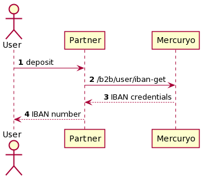

***

1. [Steps](#steps)
2. [Scheme](#scheme)

***

#### 1. Steps
The Customer wants to do fiat deposit on his IBAN. For this case you need to show the Customer his IBAN
1. You will need to authorize the Customer and check if he can use Mercuryo API. Please check [this](https://github.com/mercuryoio/Commercial-API/blob/master/Login/README.md) for more information.
2. Use method [`GET /b2b/user/iban`](https://sandbox-cryptosaas.mrcr.io/v1.6/comm-docs/index.html#api-B2B_User-IbanGet) to get user IBAN.
3. Then show it to the Customer. The Customer will do deposit on his own side. If KYC2 is expired then Mercuryo cannot complete the deposit operation. In this case the Customer needs to pass KYC2 again.

***

#### 2. Scheme

