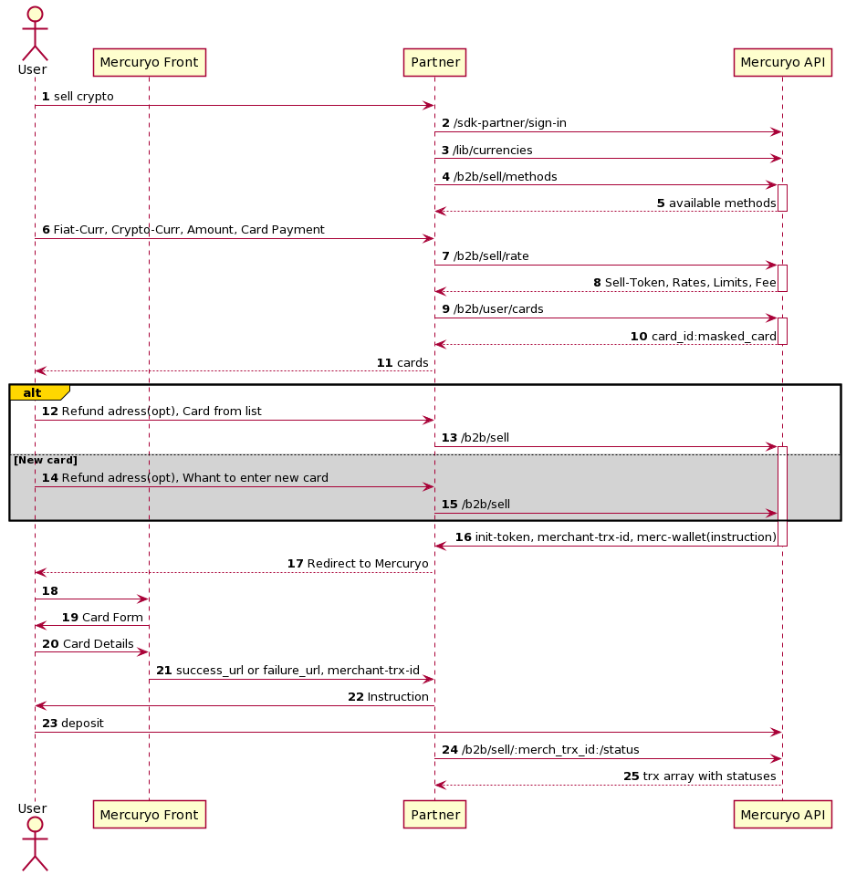

*Note: US users can not use this flow.*

***

1. [Steps](#steps)
2. [Scheme](#scheme)

***

#### 1. Steps

1. The Customer wants to sell crypto
2. You will need to authorize customer and check if he can use Mercuryo API. Please check [this](../new-sign-in/README.md) for more information.
3. Use method [`GET /lib/currencies`](https://sandbox-cryptosaas.mrcr.io/v1.6/comm-docs/index.html#api-Public-PublicCurrencies) - to show to the Custome available curencies.
4. Use method [`POST /b2b/fiat/sell-methods`](https://sandbox-cryptosaas.mrcr.io/v1.6/comm-docs/index.html#api-B2B_Sell-SellMethods) to get avaliable sell methods
5. Use method [`GET /b2b/fiat/sell-rates`](https://sandbox-cryptosaas.mrcr.io/v1.6/comm-docs/index.html#api-B2B_Sell-GetSellRate) to get rates .

Rates are frozen and associated with `sell-token`.

6. Payment Details.  
The Customer can use new card or saved card.  
To get list of saved cards use method [`GET /b2b/user/cards`](https://sandbox-cryptosaas.mrcr.io/v1.6/comm-docs/index.html#api-B2B_User-UserCards).  

    You will receive a list of masked customer's cards and `card_ids`.

    For the reason of PCI-DSS compliance Mercuryo need to get payment details on Mercuryo side. In case of passing valid card_id in method `POST /b2b/sell` the Customer will be asked for CVV only.  

 7. Use method [`POST /b2b/fiat/sell`](https://sandbox-cryptosaas.mrcr.io/v1.6/comm-docs/index.html#api-B2B_Sell-Sell) to initiate sell

`merch_tansaction_id` - transaction ID, by which you can find out its status. It is also needed to Mercuryo technical support if something going wrong. You can generate it by yourself, or Mercuryo can make it for you. Mercuryo strongly recommends you save this parameter.

8. You need to redirect the Customer to Mercuryo side by link. It will come to you in the response parameters of the [`POST /b2b/fiat/sell`](https://sandbox-cryptosaas.mrcr.io/v1.6/comm-docs/index.html#api-B2B_Sell-Sell) method.

9. If the Mercuryo registers an order, it will redirect the user to the success page, if it does not register it, then to the failure page. The success or failed url  you can specify in the [admin panel](../admin.md).
11. Transaction will be completed on the Mercuryo side.
12. Use method [`GET /b2b/transactions/:merchant_trx_id`](https://sandbox-cryptosaas.mrcr.io/v1.6/comm-docs/index.html#api-B2B_Sell-SellTransactionStatus) to get transaction status

***

#### 2. Scheme

