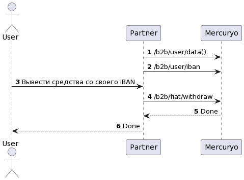

***

1. [Steps](#steps)
2. [Scheme](#scheme)

***

#### 1. Steps

1. The Customer wants to withdraw from his IBAN.
2. You will need to authorize customer and check if he can use Mercuryo API. Please check [this](../new-sign-in/README.md) for more information.
3. Use method [`GET /b2b/user/iban`](https://sandbox-cryptosaas.mrcr.io/v1.6/comm-docs/index.html#api-B2B_User-IbanGet) to get customer's IBAN. Parameter fiat_balance contains IBAN's balance data
4. In order to get fee use method [`/b2b/fiat/withdraw-estimate-fee`](https://sandbox-cryptosaas.mrcr.io/v1.6/comm-docs/index.html#api-B2B_User-EstimateFeeIban)
5. In order to get limits use method  [`/b2b/user/iban-limits`](https://sandbox-cryptosaas.mrcr.io/v1.6/comm-docs/index.html#api-B2B_User-UserIbanLimits)
6. Show IBAN to the Customer. You need to realize a form on your side in which the Customer can choose his IBAN and how much he want to withdraw.
7. Use method [`GET /b2b/fiat/withdraw`]([https://sandbox-cryptosaas.mrcr.io/v1.6/comm-docs/index.html#api-B2B_User-IbanWithdraw](https://docs.google.com/document/d/13MGAmEM2EMyGk3Q6XpybVSQ1Yx7F14C6EK5UQsMQ1yo/edit?usp=sharing)) to start withdrawal operation.
8. Show a operation's status to the Customer

***

#### 2. Scheme

