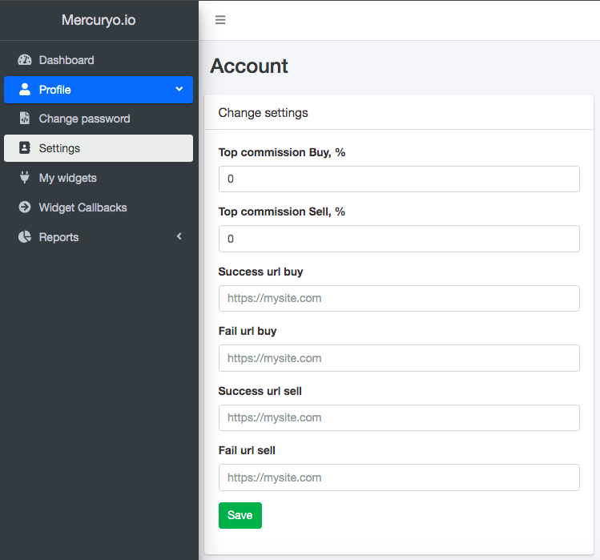

## 1. Partner admin

[Partners admin](https://partners.mercuryo.io)

# 2. How to set up success_url and failure_url

**Steps:**

1. Open partners admin.
2. Tap on Profile on the menu bar on the left.
3. Tap on Settings.
4. Fill url boxes with your links.

   ***NB:*** *all of them must be filled*

5. Save changes

   You can change links whenever you want
   

