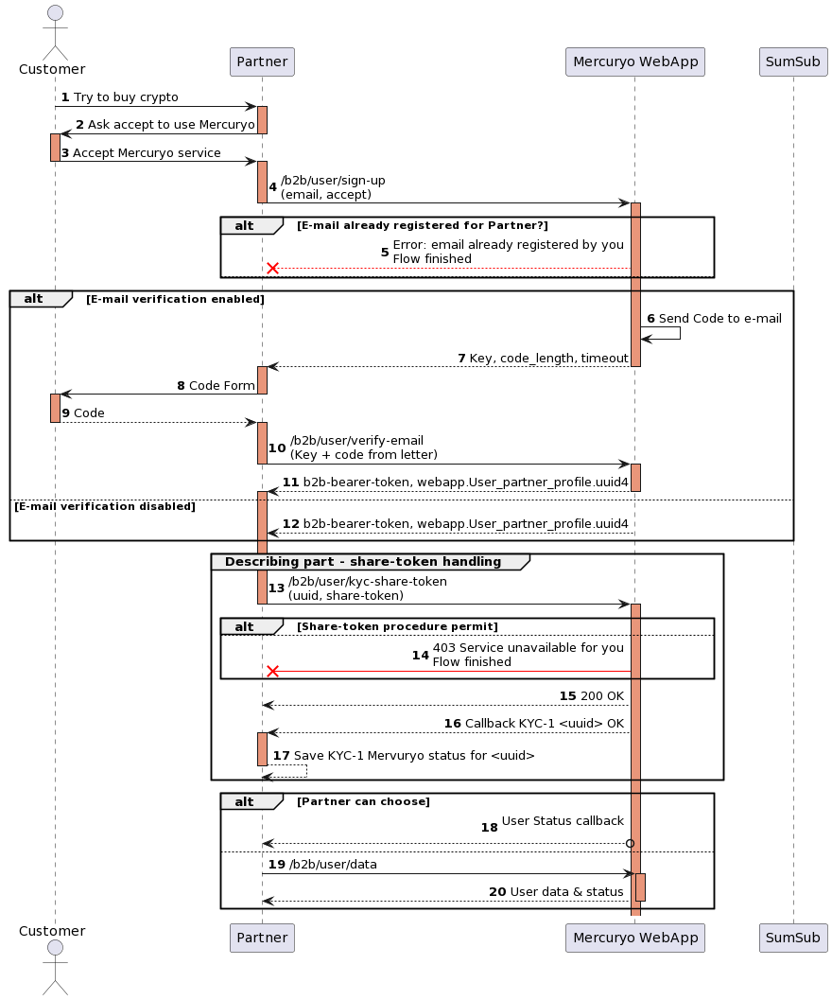
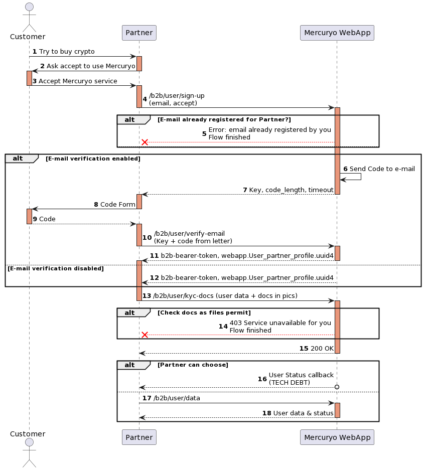

***For methods in `/sdk/` domain you need your `sdk-partner-token`. Ask your Mercuryo manager to get it.***

***

New Customers need to accept Mercuryo 'Terms and Policies'. [See Acceptance](#acceptance)

All Customers need to pass KYC authorization to use their crypto-wallets or create IBAN.

***

### Acceptance

1. You need to add to your Terms and Policy agreement to share Customers data with Mercuryo.
2. You need to make an agreement with Mercuryo that Mercuryo will use the data for registration and will use it to third parties.
3. You need to ask Customers to accept the Mercurio term in your interface before signing user in.
4. If you create a new user you need to pass Customer's acceptance to Mercuryo API. When the user is new for Mercuryo `accept` parameter is required.

***
***

**Cases**

**IN DEVELOPMENT**

Estimated rollout time of methods to prod environment:

- `/b2b/user/sign-in` - done
- `/b2b/user/sign-up` - done
- `/b2b/user/kyc-docs` - second half of April
- `/b2b/user/kyc-share-token` - second half of April
- `/b2b/user/verify-email` - May
- method to receive phone from Customer - May
- method to sign-up American citizens - May

***

1. [Sign up](#sign-up)
2. [KYC](#kyc-2)

   2.1. [Passing KYC with uploading documents to the SumSub widget](#kyc-sumsub)

   2.2. [Passing KYC with share token](#ky-share-token)

   2.3. [Passing KYC with sharing verification documents with Mercuryo](#kyc-mercuryo)

3. [Sign in](#sign-in)
4. [User data](#user-data)

***

### 1. Sing up

**Steps:**

1. Ask the Customer about his e-mail
2. Use method [`POST /b2b/user/sign-up`](https://sandbox-cryptosaas.mrcr.io/v1.6/comm-docs/index.html#api-B2B-B2BSignUp) to pass Customer's e-mail and 'accept' parameter to Mercuryo API

Request:

| Parameter  | Type | Description  |
| :-- | :--  | :--  |
| **Header** | | |
|`sdk-partner-token` | string | 	Authorization sdk partner token |
| **Body** | | |
| `email` | string | Customers's email |
| `accept` | string | Customer accepted terms and conditions |

Response with e-mail verification:

| Parameter  | Type | Description  |
| :-- | :--  | :--  |
| `status` | number | response code |
| data | object | |
| `key` | string | Public key for verification |
| `resend_timeout` | string | Time in seconds before next resend is allowed |
| `code_length` | string | Verification code length |

Response w/o e-mail verification:

| Parameter  | Type | Description  |
| :-- | :--  | :--  |
| `status` | number | response code |
| data | object | |
| `user_uuid4` | string | Customer's uuid |
| `b2b-bearer-token` | string | Authorization token |

3. Get verification code from the Customer. Code will be sent to Customers e-mail by Mercuryo
4. Use method [`POST /b2b/user/verify-email`](https://sandbox-cryptosaas.mrcr.io/v1.6/comm-docs/index.html#api-B2B-B2BEmail_verify) to verify Customers e-mail.

**This is optional.** To On\Off e-mail verification ask your Mercuryo Manager.

5. The Customer needs to pass KYC

### 2. KYC.

#### 2.1 Passing KYC with uploading documents to the SumSub widget

In this method, the user will need to go through KYC through the web view of Mercuryo by uploading the necessary documents.

Use method [`GET /b2b/user/kyc-access-token`](https://sandbox-cryptosaas.mrcr.io/v1.6/comm-docs/index.html#api-B2B_User-UserKycAccessToken) to get user's KYC token

| Error  | Text | Description  |
| :-- | :--  | :--  |
| 403004 | `User not found.` | user not found |

Then you need to redirect user to Mercuryo side by link.

Link example: `https://payments.mercuryo.io/kyc?access_token=your_token8&scheme=your_scheme&lang=lang_code`

Link must contain these parameters:

| Parameter  |  Description  | Type |
| :-- | :--  | :--  |
| `access_token` | your access token, you get it from method `GET /b2b/kyc-access-token` | obligatory |
| `success_url` | [how to set](../admin.md) urlencoded JSON | obligatory |
| `failure_url`  | [how to set](../admin.md) urlencoded JSON | obligatory |
| `status` | add to `failure_url` if the User taped on the back button - `status: back`, if you get an error as a response `status: fail` | obligatory |
| `msg` | string. This is an error message that you can get as a response from any api method | obligatory if `status: fail` |
| `scheme` | `dark` or `light` | optional |
| `lang` | language. By default it is `en`. Supported languages: `en`, `zh`, `ru`, `fr`, `hi` , `id`, `ja`, `ko`, `pt`, `es`, `tr`, `vi`  | optional |

#### 2.2. Passing KYC with share token

Registering with a share-token allows to eliminate repeat KYC verification. Share-token allows you to exchange KYC data between you and Mercuryo. If the user has passed KYC verification in your app using the SumSub service, you can generate share-token containing the user’s data and documents with SumSub and provide it to Mercuryo.

In order to use share-token use method `POST /b2b/user/kyc-share-token` to make The Customer pass KYC in SumSub.

Request:

| Parameter  | Type | Description  | Obligatory |
| :-- | :--  | :--  | :--  |
| `shareToken` | string | Share token from Partner from You | Yes |
| `resetIdDocSetTypes` | string | Specify one or few comma-separated document types if an applicant has to resubmit those documents to be verified. Examples, SELFIE, IDENTITY, etc. | No |
| `trustReview` | boolean | If you trust your partner's check result, then you should use true. If it is false, then the applicant will be rechecked. | No |
| `userid` | string | Sets your own externalUserId for the imported applicant. In case of empty value we'll generate a random one | No |

#### 2.3. Passing KYC with sharing verification documents with Mercuryo

Use method [`Post /b2b/user/kyc-docs`] to send Customers data and documents in pictures to Mercuryo. To make this method available for you contact your Mercuryo Manager.

Request:

| Parameter  | Type | Description  |
| :-- | :--  | :--  |
| **Header** | | |
|`sdk-partner-token` | string | 	Authorization sdk partner token |
| **Body** | | |
| `user_uuid` | string | Customer's uuid |
| `country_code` | string | SDK Customers's country (like 'US') |
| `first_name ` | string | SDK Customers's first name.|
| `last_name` | string | SDK Customers's last name |
| `first_name_en` | string | SDK Customers's first name |
| `last_name_en` | string | SDK Customers's last name |
| `birthday` | string | SDK Customers's last birthday. Format '1995-05-25'. |
| `document` | string | Customer's document. |
| `type` | string | User's document type (eq passport, id_card, driver_license). |
| `files` | string | User's document files. document.files must contain an array with filename as key and file content as value. For current document type requirements for list of files differs. `id_card` Count of files must be 3. File names must be `face.`, `side-1.`, `side-2.`; `passport` Count of files must be 2. File names must be `face.`, `side-1.`; `driver_license` Count of files must be 3. File names must be `face.`, `side-1.`, `side-2.`. Extensions in file names must correspond `.jpg`, .png. |

***

***

### 3. Sign in

To sign in the Customer use method [`GET /b2b/user/sign-in`](https://sandbox-cryptosaas.mrcr.io/v1.6/comm-docs/index.html#api-B2B-B2BSignIn).
As input parameters you will need to pass `sdk-partner-token` in header and `user_uuid4` **OR** `email` **OR** `phone`.

Request:

| Parameter  | Type | Description  |
| :-- | :--  | :--  |
| **Header** | | |
|`sdk-partner-token` | string | 	Authorization sdk partner token |
| **Body** | | |
| `email` | string | Customers's email for login |
| `user_uuid4` | string | Customers's uuid for login |
| `phone` | string | Customers's phone for login |

Response:

| Parameter  | Type | Description  |
| :-- | :--  | :--  |
| `status` | number | response code |
| data | object | |
| `user_uuid4` | string | Customer's uuid |
| `b2b-bearer-token` | string | Authorization token |

How to get:

1. `user_uuid4` as a response from method `POST /b2b/user/sign-up` if e-mail verification is off. Or as a response from method `POST /b2b/user/verify-email` if e-mail verification is on.
2. `email` -- from the Customer via `POST /b2b/user/sign-up`.
3. `phone` -- from the Customer. New method will be developed

### 4. User data

Use [`GET /b2b/user/data`](https://sandbox-cryptosaas.mrcr.io/v1.6/comm-docs/index.html#api-B2B_User-UserData) to get info about Customers's status

| Error  | Text | Description  |
| :-- | :--  | :--  |
| 500001 | `try later` | smth going wrong |

| Status  |  Description  |
| :-- | :--  |
| KYC status |  |
| `complete` | KYC is passed successfully|
| `under_review` | KYC is in progress |
| `failed` | KYC is failed |
| `incomplete`| KYC isn't passed |
| Email status |  |
| `confirmed` | The Customer has an email. It is confirmed |
| `not_confirmed` | The Customer has an email. But it isn't confirmed |
| User status | |
| `active` | The Customer is active. User can do transaction. To get this status user must has KYC status true |
| `inactive` | The Customer is inactive. To get this status user must has KYS status falce  |
| `blocked` | The Customer is blocked. To get this status user must be blocked |
| IBAN allowed | |
| `true` | The Customer can create IBAN or do transactions by it |
| `false` | The Customer cannot create IBAN or do transactions by it |

What to do if The Customer still inactive:
1. User need to pass KYC successful.
2. If Customers status is `temporary-blocked` user will be able to use Mercuryo in 15 min.
3. If Customers sill has problem -- ask Mercuryo support
